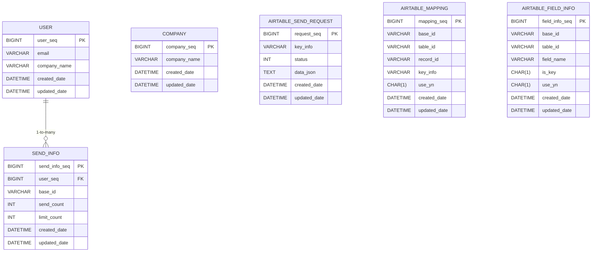

# Table Tennis PO API

이 프로젝트는 Spring Boot를 기반으로 하며, PostgreSQL 데이터베이스를 Docker Compose로 손쉽게 구성할 수 있도록 예시를 제공합니다. 또한 Swagger를 통해 API 문서화를 진행할 수 있습니다.

--------------------------------------------------------------------------------
## ERD

## 프로젝트 구조
table-tenis-po-api  
├── docker  
│   └── docker-compose.yaml  
├── gradle  
├── src  
│   └── main  
│       └── java  
│           └── com.gomdoc.ttspo  
│               ├── common  
│               │   ├── constants  
│               │   │   └── ResultCode.java  
│               │   └── GomdocUtils.java  
│               ├── controller  
│               │   ├── ModelMapperConfig.java  
│               │   └── SwaggerConfig.java  
│               ├── model  
│               │   └── dto  
│               │       ├── UserBaseDTO.java  
│               │       ├── UserCreateDTO.java  
│               │       ├── UserResponseDTO.java  
│               │       └── UserUpdateDTO.java  
│               ├── entity  
│               │   └── User.java  
│               ├── repository  
│               │   └── UserRepository.java  
│               └── TtspoApplication.java  
│       └── resources  
│           └── application.yaml  
└── build.gradle

- controller: Swagger 설정(SwaggerConfig) 및 기타 컨트롤러 로직
- model/dto: API 요청/응답에 사용될 DTO 클래스들
- entity: JPA 엔티티 클래스 (User)
- repository: 데이터베이스 접근을 위한 JPA Repository (UserRepository)
- common: 프로젝트 공용으로 사용하는 유틸, 상수, 도메인 클래스 등
- TtspoApplication: Spring Boot 메인 어플리케이션 클래스
- application.yaml: Spring Boot 설정(포트, DB 연결 정보 등)
- docker-compose.yaml: PostgreSQL 컨테이너 설정

--------------------------------------------------------------------------------

## 사전 준비

- Java 11 이상 (또는 프로젝트에 설정된 Java 버전)
- Gradle (또는 Gradle Wrapper)
- Docker와 Docker Compose가 설치되어 있어야 합니다.

--------------------------------------------------------------------------------

## PostgreSQL 설정 (Docker Compose)

`docker` 디렉토리에 있는 `docker-compose.yaml` 파일을 사용해 PostgreSQL 컨테이너를 실행할 수 있습니다.

    cd docker
    docker-compose up -d

아래는 docker-compose.yaml 예시이며, 필요에 따라 조정할 수 있습니다:

    version: '3.8'
    services:
      postgres:
        image: postgres:14
        container_name: table-tennis-postgres
        environment:
          POSTGRES_USER: postgres
          POSTGRES_PASSWORD: postgres
          POSTGRES_DB: ttspo_db
        ports:
          - "5432:5432"
        volumes:
          - db-data:/var/lib/postgresql/data
    volumes:
      db-data:

주의: 실제 운영 환경에서는 보안상 비밀번호 등 민감 정보를 직접 노출하지 않도록 유의해야 합니다.

--------------------------------------------------------------------------------

## Spring Boot 애플리케이션 설정

`application.yaml`에서 DB 정보를 확인 및 수정합니다.

    spring:
      datasource:
        url: jdbc:postgresql://localhost:5432/ttspo_db
        username: postgres
        password: postgres
      jpa:
        hibernate:
          ddl-auto: update
        show-sql: true
    
    server:
      port: 8080

- url, username, password 값을 Docker Compose 설정과 동일하게 맞춰줍니다.
- ddl-auto 옵션은 개발 환경에서만 update로 사용하고, 운영 환경에서는 적절히 변경하는 것을 권장합니다.

--------------------------------------------------------------------------------

## 빌드 및 실행

1) Gradle 빌드  
   프로젝트 루트 디렉토리(table-tenis-po-api)에서 다음 명령어를 실행합니다.

   ./gradlew clean build

2) Spring Boot 애플리케이션 실행

   ./gradlew bootRun

애플리케이션이 정상적으로 실행되면, 기본적으로 http://localhost:8080 에서 서비스에 접근할 수 있습니다.

--------------------------------------------------------------------------------

## Swagger를 통한 API 문서 확인

Spring Boot 애플리케이션이 구동된 상태에서, Swagger UI는 다음 경로에서 접근 가능합니다.

    http://localhost:8080/swagger-ui/index.html

Swagger 설정은 SwaggerConfig 클래스를 통해 이루어지며, API 문서에 각 엔드포인트에 대한 설명과 테스트 기능이 포함되어 있습니다.

--------------------------------------------------------------------------------

## 주요 엔드포인트 예시

아래는 간단한 예시이며, 실제 엔드포인트와 파라미터, 응답 구조 등은 Swagger 문서를 참고하세요.

| 메서드 | URL                | 설명             |
|-------|--------------------|------------------|
| GET   | /api/v1/users      | 모든 사용자 조회 |
| GET   | /api/v1/users/{id} | 사용자 단건 조회 |
| POST  | /api/v1/users      | 사용자 생성      |
| PUT   | /api/v1/users/{id} | 사용자 정보 수정 |
| DELETE| /api/v1/users/{id} | 사용자 삭제      |

--------------------------------------------------------------------------------

## DTO 예시

- UserCreateDTO: 사용자 생성 시 필요한 필드를 담는 DTO
- UserUpdateDTO: 사용자 수정 시 필요한 필드를 담는 DTO
- UserResponseDTO: 사용자 정보 조회 시 반환되는 DTO

예시:

    public class UserCreateDTO {
        private String email;
        private String companyInfo;
        // ...
    }

--------------------------------------------------------------------------------

## 주의 사항

- Docker Compose를 사용하기 전, 로컬 환경에서 다른 PostgreSQL 서비스가 5432 포트를 사용 중인지 확인이 필요합니다.
- 운영 환경에서는 보안과 성능, 장애 대비를 위한 추가 설정이 필요합니다.
- ddl-auto: update 설정은 개발 편의를 위해 사용하며, 운영 환경에서는 마이그레이션 도구(예: Flyway, Liquibase)를 사용하는 것을 권장합니다.

--------------------------------------------------------------------------------

## 라이선스

- 이 프로젝트는 별도의 라이선스가 명시되지 않은 경우, 내부 사용 목적에 따라 자유롭게 수정/배포가 가능합니다.
- 상업적 이용 또는 재배포 시 저작권 관련 사항을 반드시 확인하시기 바랍니다.
